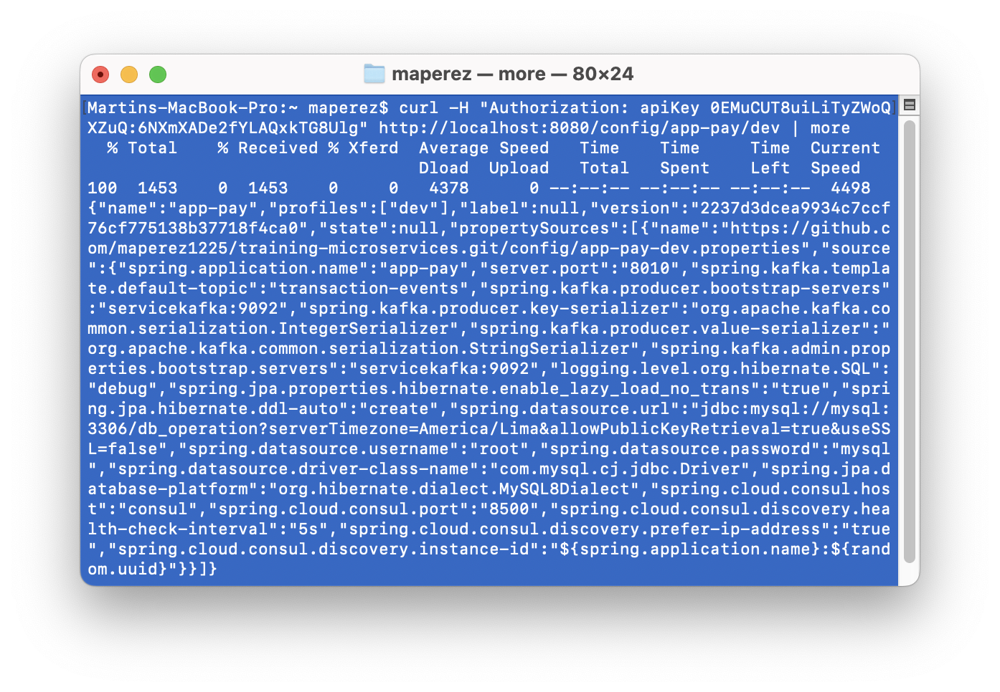
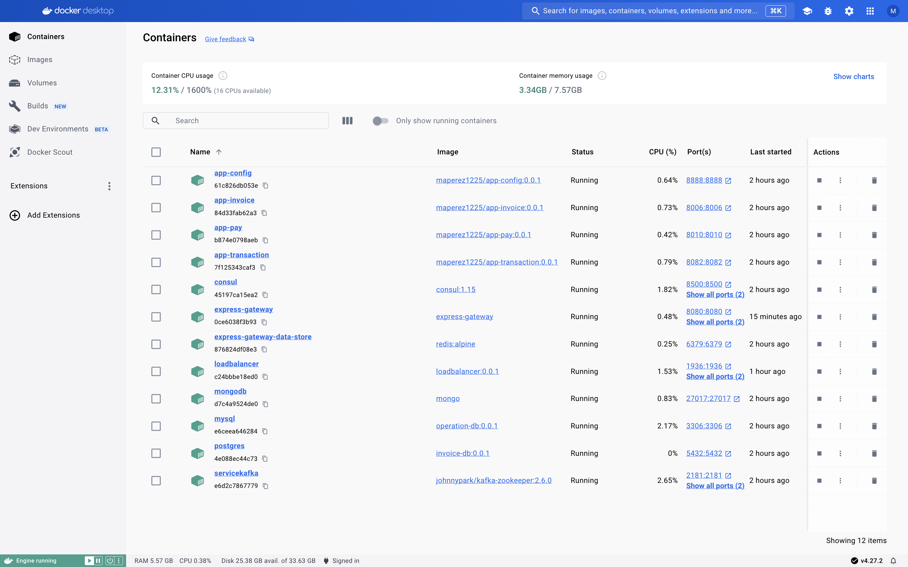
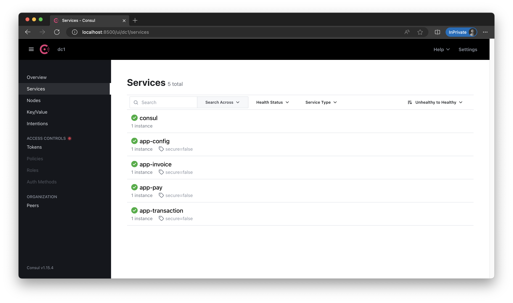
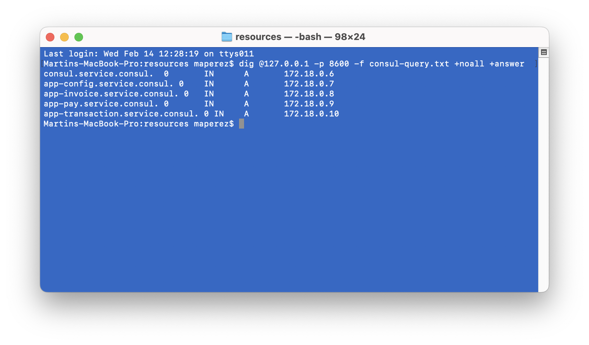

# sd-workshop5 2024-1
Create load balancer image in haproxy/

`docker build -t loadbalancer:0.0.1 .`

Run redis db for app gateway

`docker run -d --rm -p 6379:6379 --network distribuidos --name express-gateway-data-store redis:alpine`

Run app gateway

`docker run -d --rm --name express-gateway --network distribuidos -p 8080:8080 -p 9876:9876 -v ./appgw:/var/lib/eg express-gateway`

Obtain API key from Express Gateway terminal

`eg credentials create -c [user] -t key-auth -q`

Curl API endpoint with key

`curl -H "Authorization: apiKey ${keyId}:${keySecret}" http://localhost:8080/config/app-pay/dev`

Containers running

# sd-workshop4 2024-1

Service Registration in Consul:

Consul services query with dig:

# sd-workshop1 2024-1
### Dependencies:
Build database for invoice service using postgres. [Directory](https://github.com/maperez1225/sd-workshop1/tree/master/resources/postgres).

Run in resources/postgres/

`docker build -t maperez1225/invoice-db:0.0.1 .`

`docker run -d --rm -p 5432:5432 --network distribuidos --name postgres maperez1225/invoice-db:0.0.1`

Run an instance of Kafka and Consul

`docker run -p 2181:2181 -d --rm -p 9092:9092 --name servicekafka --network distribuidos -e ADVERTISED_HOST=servicekafka -e NUM_PARTITIONS=3 johnnypark/kafka-zookeeper:2.6.0`

`docker run -d --rm -p 8500:8500 -p 8600:8600/udp --network distribuidos --name consul consul:1.15 agent -server -bootstrap-expect 1 -ui -data-dir /tmp -client=0.0.0.0`

### Running App Config:
Build image including all dependencies and correct port mappings. [Directory](https://github.com/maperez1225/sd-workshop1/tree/master/app-config).

Run in app-config/

`docker build -t maperez1225/app-config:0.0.1 .`

`docker run -d --rm -p 8888:8888 --network distribuidos --name app-config maperez1225/app-config:0.0.1`

### Running Invoice App
Build image including all dependencies and correct port mappings. [Directory](https://github.com/maperez1225/sd-workshop1/tree/master/app-invoice).

Run in app-invoice/

`docker build -t maperez1225/app-invoice:0.0.1 .`

`docker run -d --rm -p 8006:8006 --network distribuidos --name app-invoice maperez1225/app-invoice:0.0.1`

### Functionality:
Containers running

Invoice App Config

Consul
